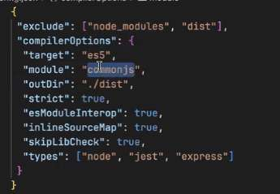
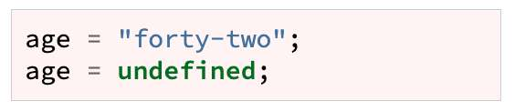
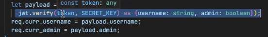
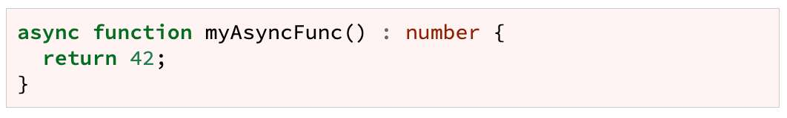

---
date: 2023-05-01
metadata: true
concepts: ['typescript', 'typing']
status: 'pre-lecture'
docs: 
	migrating-from-javascript: "https://www.typescriptlang.org/docs/handbook/migrating-from-javascript.html"
cite: ['rithm']
---

## Goals

-   Understand what TypeScript is
-   Understand benefits/drawbacks of typing
-   See some basic examples of TS fundamentals
-   Use interfaces to define a type pattern for an object

## What is TypeScript?

- TypeScript is a _superset_ of JavaScript
    - Everything that javascript has and more
    - Any JavaScript program is _already_ TypeScript
        - js is syntactically correct in ts - just as is, isn’t using any of the benefits
- Browsers don’t use TypeScript directly; it needs to be transpiled (translate + compiled)
- Primarily provides *optional static typing*, classes and interfaces
	- static typing - as written
	- dynamic typing - can change type
- Helps editors to spot type errors while writing/reading code
	- 50-70% of the bugs by Joel estimate: 
		- this input is not the thing I thought it was
		- forgot it could also be undefined…etc.
- Typescript can be gradually added in, or just added to future code without having to change everything in the current js codebase

```ts nums {5}
let score = 0
// score is a number now

// TS won't allow type changes
score = "zero"    // error
```

```ts nums {}
function rando() {
  return (Math.random() < 0.5)
    ? 42
    : "string";
}

let either = rando();
// can only use methods common
// to both strings and numbers
```

### Static vs Dynamic Languages

- Statically typed:
	- Java
	- Swift
	- C / C++
- Dynamically typed:
	- Ruby
	- Python (optionally typed)
	- JavaScript
	- PHP

### Benefits / Drawback of Typing

- Benefits:
	- Spot bugs early at compile time
	- Predictability / readability
- Drawbacks:
	- Code can be more verbose
	- Learning curve

### How popular is TypeScript?


StackOverflow survey in late 2021
Later survey even said 45%

## Getting started

### Compiling

```shell
$ npm install typescript
```

compile `hello.ts` to `hello.js`
```shell
$ npx tsc hello.ts
```
-**npx** → execute this thing in npm
-silence is good news

- By default, will put file in the same folder, but you can specify if you want this to be different:
compile `hello.ts` to `out/hello.js`
```shell
$ npx tsc --outDir out hello.ts
```

### Configuration file

- TypeScript uses `tsconfig.json`, if it exists:
```shell
$ npx tsc --init
```

- This lets you configure typescript for your project
- Shows *ALL* possible options, with defaults
- The ones that are most likely to be changed are uncommented out and set to default

joel demo settings:

-target: which version to transpile to
-module: keeping the require
-outDir: where do you want to put things when you compile them
-strict: typing always = true, false= can get away with more things
-the rest: defaults, just put them in

`tsconfig.json`
```json
{
  "compilerOptions": {
    "target": "es2016",
    "module": "commonjs",
    "strict": true,
    "esModuleInterop": true,
    "skipLibCheck": true,
    "forceConsistentCasingInFileNames": true
  }
}
```

- ~ Tip: Documentation on TS compiler
	- See [Compiler options](https://www.typescriptlang.org/docs/handbook/compiler-options.html) and [TSconfig options](https://www.typescriptlang.org/docs/handbook/tsconfig-json.html)

- ~ Hint: Can use Webpack / Create React App for this
	- When you build projects, you will not want to manually type npx tsx every time, thankfully there are tools like Webpack that will do this bundling and compiling for you.
	- When we write TypeScript with React, Create React App will automatically compile and handle this process for us.

### TypeScript Playground

- A great way to play with TypeScript
	- [https://www.typescriptlang.org/play/](https://www.typescriptlang.org/play/)
- VS Code is also great

## TypeScript basics

### Variables

```ts
// learns that age is a number
let age = 42;

// or: provide type explicitly
let age: number;
```

- Editor and compiler can detect errors
	- !! Invalid methods
	  
	- !!  Redefining to invalid value (value of a different type)
	  

### Arrays

```ts
const sillyBabyNames = ["Carrot", "Chicken Nugget"];
sillyBabyNames.push("Kale");
```

- This will learn this is an array of strings:
```ts
// will throw a type error
sillyBabyNames.push(1337);
```

- Creating empty arrays:
```ts
const anyValue = [];

// could add anything to:
anyValue.push("string", 1337);

// can specify type for items directly
const onlyStrings: string[] = [];

// would throw an error
onlyStrings.push("string", 1337);
```

### Objects

- There are things in the object, so it will infer types
```ts
let movieData = {
  title: "The Godfather",
  year: 1972,
};
```

- Will learn types and enforce:
```ts
movieData.year = 2022;    // ok!
movieData.year = "nope";  // error!
```

- & *Cannot* add new properties, though:
```ts
movieData.director = "Coppola";    // error!
```
- Typescript views objects as a structured piece of information - can’t add new keys, etc.

### Records

- An object type that can handle new keys using 
  `Record<keyType, valueType>`:

```ts
const person: Record<string,string> = {};

person.firstName = "Enzo";
```

- That angle-bracket syntax is using a “generic”.

- ~ Tip: Map can also be used for this
	- The Map type in TypeScript/JavaScript is also an alternate way to handle arbitrary keys. 
	- Maps are often better choices because they can have non-string keys and can sort sensibly.
	```ts
	let letterToScore = new Map([
	  ["A", 1],
	  ["B", 3],
	]);
	```
	- Will learn type `<string, number>` for this Map:
	```ts
	letterToScore.set("C", 2);       // ok!
	letterToScore.set("D", "oops");  // error!
	```
	- Specifying type explicitly:
	```ts
	let letterToScore = new Map<string, number>();
	
	letterToScore.set("C", 2);       // ok!
	letterToScore.set("D", "oops");  // error!
	```

### Functions

- With Typescript, functions *need to specify return type*
	- Though return type is optional if can be inferred
	- BUT, best to *always* type because:
		- Improves readability
		- Prevents you from accidentally returning something else if you change code later
```ts nums {1}
function isSeven(n: number): string {
  if (n === 7) return "THAT IS INDEED 7!";

  return "NOPE, NOT SEVEN :( ";
}
```

- & Cannot pass too many/two few/wrongly-typed arguments:
```ts nums
isSeven();            // error!
isSeven(1, 2);        // error!
isSeven("one");       // error!
```

- If your function returns undefined, mark the return type as void.
```ts nums {1}
function hi(): void {
  console.log("HI"); // doesn't return anything!
}
```

### Classes

- Methods on a Class also need types added to:
	- properties (first thing after Class declaration)
	- methods
```ts nums {2,8}
class Cat {
  name: string;

  constructor(name: string) {  
    this.name = name;
  }

  dance(dance: string = "tango"): string {
    return `${this.name} dances the ${dance}`;
  }
}

let fluffy = new Cat("Fluffy");
```
-  Note: constructor fxs by definition do not return anything

## Interfaces

- You can define your own types, called an _interface_.
	- Interface is just a *nickname for a type declaration*
	- May look a little like a class, but isn’t actually a class

```ts nums
interface UserInterface {
  username: string;
  age: number;
}

let jane: UserInterface = {
  username: "jane",
  age: 42,
};
```

- This will enforce requirements:
```ts nums 
let bob: UserInterface = {
  username: "bob",
};                            // error
```

- To make optional entries:  
	- Just add ? after label
```ts nums {3}
interface UserInterface {
  username: string;
  age?: number; // same as age: (number | undefined)
}

// Now don't have to specify age:
let jane: UserInterface = {
  username: "jane",
};

```

- ~ Tip: How should you name interfaces?
	- There are two different popular opinions here:
		- Name it descriptively with the word “Interface” at the end, like UserInterface.
		- Name it descriptively but with a leading “I”, like IUser.
	- Our lead instructors have different opinions here, and your company will probably have a preferred style. 
	- Remember, always match existing code style practices.

- Define interfaces either:
	- At the top of the file
	- In their own file

### Interfaces and functions

```ts
function showUserInfo(user: UserInterface): void {
  console.log(`${user.username} is ${user.age}`);
}
```

```ts
function makeRandoUser(name: string): UserInterface {
  return {
    username: name,
    age: Math.floor(Math.random() * 100),
  }
}
```

- Can specify “compatible” part of interface:
```ts
interface StudentInterface {
  name: string;
  cohort: string;
}

interface InstructorInterface {
  name: string;
  salary: number;
}

function getUpperName(person: {name: string}): string {
  return person.name.toUpperCase();
}
```

- ~ Note: Another way to make your own types
	- In addition to interfaces, there also exists a keyword called *Type* which you can use to create custom types.
	```ts
	// define the type
	type Status = [number, string];
	
	// use it
	let response1: Status = [404, "NOT FOUND"];
	let response2: Status = [200, "OK"];
	```
	- This is similar to, but different from interfaces. It’s not important to learn about this now, but if you end up working a lot with TypeScript, it will be helpful information.
	- [You can read more about the differences here](https://react-typescript-cheatsheet.netlify.app/docs/basic/getting-started/basic_type_example/#useful-table-for-types-vs-interfaces)

## Flexible types

### Choice of types

- Can provide multiple type possibilities:
```ts
let x: number | string;

x = 42;
x = "hello";
```

- & Can use only methods common to both strings and numbers.

### Opting out with any

- For the ultimate flexibility, can use type *any*:
```ts
let x: any;

x = 42;
x = "hello";
```

- ! Be cautious about this — you lose the benefits of typing!

## Forcing type info

### Forcing a type

- If you have more info about a value than TypeScript could, use *as*:
	- When you know more than typescript
	- You can tell TypeScript what to consider this thing as
```ts
const h1 = document.querySelector("h1") as HTMLELement;
```

Good example of this in bankly:

- Typescript has no idea what token is
	- but we know it’s an object with username and admin as keys

### Forcing not null/undefined

- A function might be typed to return a string or null (or undefined):
```ts nums
function myFunc(s: string): string | null {
  if (s === "nope") return null;
  return "ok!";
}
```

- If you *know* that it will return a non-null, non-undefined value, you can tell it that when you call it:
```ts nums {4}
let a = myFunc("good");
a.slice();                  // error!

let b = myFunc("good")!;    // note the "!"
// same as saying let b = myFunc("good") as (string | number);
// just simpler/faster to use ! to take out all null/undefined
b.slice();
```
-The `!` says take out the null or undefined from return possiblities


### Checking types

```ts nums {8}
function maybe(): string | void {
  if (Math.random() < 0.5) return "ok";
}

let x = maybe();

if (typeof x === "string") {
  // can use string methods here!
}
```

## Async functions

- Remember, async functions return promises.


- Instead, do this:
```ts nums {2}

async function myAsyncFunc() : Promise<number> {
  return 42;
}
```


## Next steps

-   Start small!
-   [Migrating from JavaScript](https://www.typescriptlang.org/docs/handbook/migrating-from-javascript.html)
-   [Todo App in Typescript](https://ts.chibicode.com/todo/)
-   You *really* do not need to know everything

