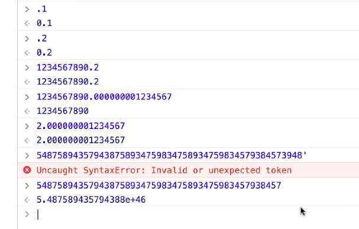
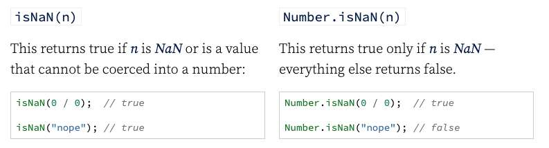
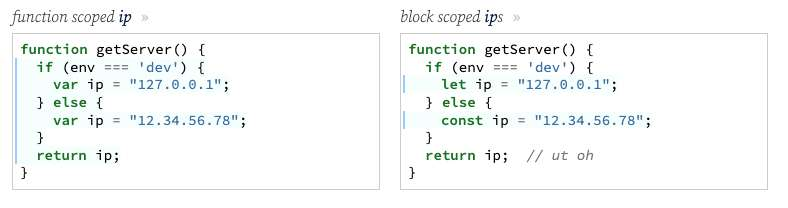
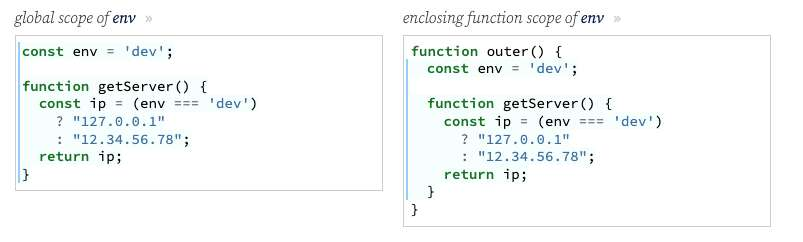
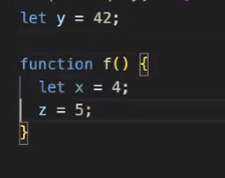
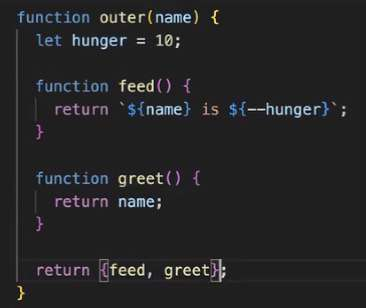
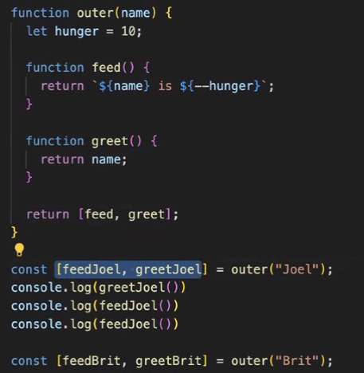
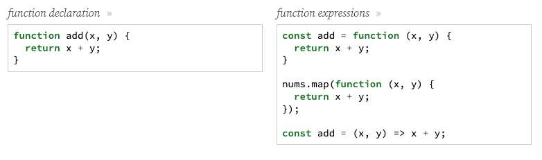
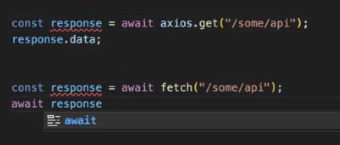

---
date: 2023-06-06
metadata: true
concepts: []
status: 'pre-lecture'
docs: 
cite: ['rithm']
---

## Topics and goals

### Topics

-   Numbers, imprecision, and NaN
-   Scope, closure, and hoisting
-   Asynchronicity and AJAX
-   Semicolons
-   Trivia
-   Areas to explore
-   Design patterns

### Goals

-   Understand tricky intermediate edges in JavaScript
-   Learn further areas to explore
-   Make sure you’re ready for interview questions!

## Must know: critical core

- Common methods for [String](https://developer.mozilla.org/en-US/docs/Web/JavaScript/Reference/Global_Objects/String), [Array](https://developer.mozilla.org/en-US/docs/Web/JavaScript/Reference/Global_Objects/Array), [Number](https://developer.mozilla.org/en-US/docs/Web/JavaScript/Reference/Global_Objects/Number), and [Object](https://developer.mozilla.org/en-US/docs/Web/JavaScript/Reference/Global_Objects/Object)
- [Type checking / conversion](https://www.freecodecamp.org/news/js-type-coercion-explained-27ba3d9a2839/)
- [JS equality](https://developer.mozilla.org/en-US/docs/Web/JavaScript/Equality_comparisons_and_sameness) == vs ===

## Numbers

### Floating point imprecision

JavaScript represents numbers as _floating point_, like `1.234`.

Sometimes, this leads to mildly imprecise results:

```js
0.1 + 0.2 === 0.30000000000000004
```

This can lead to bugs: this if condition will fail: `.1 + .2 === .3`

- The numbers that this occurs with is:
	- `.1`
	- `.2`
	- …and more

- ~ Tip: Other workarounds
	- Some classic strategies for dealing with the imprecision of floating point numbers:
		-   Represent the number as a string, if you don’t need to do math on it
		-   For things like prices, instead of having a variable like `1.23` for “one dollar twenty-three cents”, store it as `123` (“one hundred and twenty-three cents”). Now many operations can stay as integer operations, and benefit from speed and accuracy.
	- You can learn more at [What Every JavaScript Developer Should Know About Floating Points](https://modernweb.com/what-every-javascript-developer-should-know-about-floating-points/)

- ~ Note: Why does this happen?
	- Understanding in depth how computers store floating point numbers will take some time, and probably isn’t worthwhile unless you’re very curious about it or you have very low-level problems you need to solve with computers. If you do need to dig into the deep details, this is the classic paper on it: [What Every Computer Scientist Should Know About Floating-Point Arithmetic](https://docs.oracle.com/cd/E19957-01/806-3568/ncg_goldberg.html).

- the way that js works with floating point numbers:
	- you either have precision at the beginning or the end
	- roughly gets to the number of digits


### Not a Number

JavaScript’s NaN value can be tricky. It often comes from:

-   Logical math errors, like `0 / 0`
-   Imaginary numbers, like `Math.sqrt(-1)`
-   Conversion errors, like `Number("nope")`

### Checking for NaN

All NaN values are considered unique, so `NaN === NaN` is false.

If you need to check for NaN, there are two different ways:


`isNaN(n)`

This returns true if n is NaN or is a value that cannot be coerced into a number:

```
isNaN(0 / 0);  // true

isNaN("nope"); // true

```

`Number.isNaN(n)`

This returns true only if n is NaN — everything else returns false.

```
Number.isNaN(0 / 0);  // true

Number.isNaN("nope"); // false

```

- ! Warning: Don’t check for NaN like this…
	- You may see code like this:
	```js
	// if n is NaN, print error
	if (n !== n) console.error("ut oh");
	```
	- That relies on the fact that NaN is not equal to itself. This code works, but it’s not a good way to express this — if you want to check for NaN, use one of the methods above.

### ++x and x++

- There is a difference between `++x` and `x++`:

```js
let x = 5;
let y = ++x;    // add 1 to x then evaluate: y and x are both 6

let x = 5;
let y = x++;    // evaluate x and set y that, then add 1 to x
```

- Using `x++` is often useful as a return statement — return this value to caller, but bump up for next time:

```js
class Counter {
  constructor() {
    this.current = 1;
  }
  next() {
    return this.current++;
  }
}
```

## Scope and closure

### Scope

- Variable can be _function scoped_ or _block scoped_:


function scoped ip[
```js
function getServer() {
  if (env === 'dev') {
    var ip = "127.0.0.1";
  } else {
    var ip = "12.34.56.78";
  }
  return ip;
}
```

block scoped ips
```js
function getServer() {
  if (env === 'dev') {
    let ip = "127.0.0.1";
  } else {
    const ip = "12.34.56.78";
  }
  return ip;  // ut oh
}
```

- Variables have access to _enclosing scopes_:

global scope of env
```js
const env = 'dev';

function getServer() {
  const ip = (env === 'dev')
    ? "127.0.0.1"
    : "12.34.56.78";
  return ip;
}
```

enclosing function scope of env
```js
function outer() {
  const env = 'dev';

  function getServer() {
    const ip = (env === 'dev')
      ? "127.0.0.1"
      : "12.34.56.78";
    return ip;
  }
}
```

- Shadowing:
```js nums {2, 4, 6}
function getServer(){
	let ip;
	if (env === 'dev') {
		let ip = "127.0.0.1";
	} else {
		let ip = "12.34.56.78";
	}

	return ip;
}

```
Lines 4 and 6 “shadow” line 2 
- !! Bad: Don’t write code like this

- Watch out for global variable declarations:

z is now a global variable

### Closures

- The ability for inner functions to remember/access variables defined in outer functions, long after the outer function has returned
- How to make one? 
	- nest an inner function in an outer function
	- return that inner function (non-invoked)

```js
function fn() {
	let f = Math.random(); //.5

	function inner() {
		console.log(f)	
	}

	return inner;
}

const innerIGot = fn() //.5
innerIgot(); // WILL Still print .5!
const innerIgot2 = fn(); //.3  (gets a diff random num this time)
innerIGot2(); // born of a world where f was .3, will print .3
innerIGot(); // born of a world where f was .5, will print .5
```

- Function fn returns the *actual function inner*  / *its actual call frame*

- Useful for encapsulating logic and _data hiding_.
```js
function idGenerator() {
  let start = 0;
  return function generate() {
    start += 1;
    return start;
  };
}
```
- Closures & OO
	- You can often use closures for something you could solve with OO; closures and classes have a lot of theory overlap.
	- Closure is poor man’s OO
	- different approaches to the same end goal

- React is made of closures
	- how state works: use state is an outer fx with an  inner state that keeps that piece of information alive

- can have multiple functions




Can you spot the closure?

- ~ Note: Loops and function scoping with closure
	- Consider this code carefully:
	```js
	for (var i = 0; i < 5; i++) {
	  setTimeout(function () {
	    console.log(i);
	  }, 1000);
	}
	```
	- This looks like a a straightforward closure — the anonymous function provided to setTimeout has closed-over access to i.
	- However, note: by the time that anonymous function runs, i has already increased to 5, so this will print 5 all five times — since we’re using a var for i, that variable is shared among all loops.
	- Nowadays, this is easily fixed by declaring i with let or const: then, _each_ i will be different, and the function passed to setTimeout will have its own individual i.
	- This used to be a tricky JS question, but by using block-scoped variables, it no longer is a problem.

### Function declarations vs expressions


function declaration
```js
function add(x, y) {
  return x + y;
}
```

function expressions
```js
const add = function (x, y) {
  return x + y;
}

nums.map(function (x, y) {
  return x + y;
});

const add = (x, y) => x + y;
```

- You can “trick” JavaScript into reading a function as an expression like so:

more function expressions
```js
(function (x, y) {
  return x + y;
});

+function (x, y) {
  return x + y;
};
```

Those aren’t useful by themselves, but just wait …

Immediately Invoked Function Expressions
- used to not stomp on others variables
- very old / outdated way of doing things, way better way of doing things
```js
(function (x, y) {
  return x + y;
});

+function (x, y) {
  return x + y;
}(). // invoked immediately here
```


- ~ Statements vs expressions
	- Many programming languages have two different ideas:
- Statement
	- A bit of code that _does something_ but doesn’t return any kind of value, and can’t be directly assigned to a variable.
- Expression
	- A bit of code that can also _do something_ but does return a value, and can be assigned to a variable.
- In JavaScript, for example, these are some expressions:
	```js
	// this calls the function but evaluates to what it returns
	myFunc()
	
	// This changes x, but also evaluates to 42
	x = 42;
	```
	- And here are some statements:
	```js
	// you can't assign the for loop to a variable
	for (let i = 0; i < 99; i += 1) { ... }
	
	// you can't assign the if statement to a variable
	if (cat === 'Fluffy') tango()
```
	- JavaScript is interesting: it has syntax for creating functions as statements (via a declaration starting with function) or as an expression (via a function expression or an arrow function, which are always expressions). Most languages have one way to create functions, or use a different name for statement-functions and expression-functions.

### Hoisting

-   var variable _declarations_ are pulled to the top of their function
    -   So the variable is legal, but equal to undefined until definition
-   let / const variables are not hoisted to the top of their block
    -   So referring to them before where they appear is an error
-   A var\-variable function expression will be hoisted, but it’s only  
    the declaration of the variable — not the function code itself!
-   Regular function declarations are hoisted, along with the definition

## Asynchronicity and AJAX

- & Carefully review our [async lecture](https://rithm-students-assets.s3.amazonaws.com/r30/lectures/tech-js-tricky-parts/js-async/)

### AJAX with fetch()

- Our curriculum uses **axios**, because it’s powerful and popular.
- Modern JS has a built-in decent API for AJAX, [fetch](https://developer.mozilla.org/en-US/docs/Web/API/Fetch_API).
- (It’s useful to know about it; some code challenges request you don’t use any external libraries, so knowing about fetch will help)
- Slightly more difficult:


## Semicolons

- You can write JavaScript with or without semicolons; if you omit them, they will be inserted by JS in a process known as _ASI_, _automatic semicolon insertion_.
- Mostly, this means it works, either way — but there are some edges

### Missing semicolons

Here’s a case where you need semicolons:

bug!
```js
console.log("hello")

[x, y] = [1, 2]
```

works
```js
console.log("hello");

[x, y] = [1, 2]
```

- ~ Note: Why is this a bug?
	- The intent here is to destructure that array into x and y variables — however, since line 1 doesn’t have a semicolon, JS assumes the square bracket opening on line 3 is “square brackets as array index”. A semicolon terminating line 1 fixes that.
	- The same thing will happen with an open braces for object destructuring, and a few other places.
	- Use the style of your company/project, and if its new code, use semicolons.

- Webpack: 
	- squishes multiple code pieces together, would definitely come to really subtle, very confusing bugs if you don’t put semicolons

### Line break errors

- Regardless of whether you use semicolons or not:

bug!
```js
function createPerson(first) {
  return       // js returns here - would return undefined  
    { first };
}

createPerson('Steph'); // undefined
```

works
```js
function createPerson(first) {
  return { first };
}

createPerson('Steph'); // { first: 'Steph' }
```

- JavaScript ASI adds a semicolon on the same line with return. Watch out!

## Areas to explore

### Regular expressions

- A mini-language for text matching and processing; for developers who manipulate text-based data, this is an essential toolkit.
- It’s not specific to JavaScript (many languages provide regular expressions,  
so learning it once will be useful in other places).

### Try/catch/finally

- try blocks can also have a finally block, containing code that should _always_ be run when the function is exited, either when it returns or if an error is throw and caught elsewhere.
```js
function myFunc() {
  try {
    // do something potentially causing an error
  } catch {
    // catch the error and deal with
  } finally {
    // no matter what happens, this will be run
  }
}
```
- This is useful when you need to “clean up” something (close a file, disconnect from a server, etc) no matter how your function exits.

### Generators and yield

- JavaScript can have _generator functions_ — functions that return a _Generator_ that can be lazily looped over:
	- Note syntax of star after function is required for generator functions

```js
function* evens(n) {
  while (true) {
    yield n;
    n += 2;
  }
}
```

```js
// make a "Generator":
// will return even numbers 2+
let allEvens = evens(2);

// lazily get the first 10 even numbers
for (let i=0; i < 10; i += 1) {
  console.log(allEvens.next().value);
}
```

- Doing things lazily like this is a huge benefit with large-scale data.

## Design patterns
name for a good idea that is good enough to get designated a name
(sean idea: model, view, controller)

- Named common practices in code; can be very useful to learn about:
	- module pattern - keeping things in 1 file, so variables don’t stomp on each other
	- singleton pattern - class that you only ever make 1 instance of
	- many others: adapter, observer, mixin, façade and more!
		- facade: queue: can internally designate to a linked list, etc.
- Good place to start: [Understanding design patterns in JavaScript](https://blog.bitsrc.io/understanding-design-patterns-in-javascript-13345223f2dd)
- More — a free online book: [Learning JavaScript Design Patterns](https://addyosmani.com/resources/essentialjsdesignpatterns/book/).

## JS: the trivia parts
#interviewQuestions

- all possible values of this
- new keyword and exactly what it does
- pre-es2015 object orientation
- rules for type conversion and equality
	- what does js exactly do - does it convert string to number or number to string
- _“what does this output?”_

destroyallsoftware.com wat

## Learning more

### Coming up

-   Prototypes and object orientation
-   Functional programming concepts

### Learn more and practice


[JavaScript: The Definitive Guide (7th Ed)](https://www.amazon.com/JavaScript-Definitive-Most-Used-Programming-Language/dp/1491952024/)

Other great places:

- [Our website curriculum](https://www.rithmschool.com/courses/advanced-javascript)
- [The Advanced Web Developer Bootcamp](https://www.udemy.com/course/the-advanced-web-developer-bootcamp/) _(particularly: sections on closure + OOP)_
- [A re-introduction to JavaScript](https://developer.mozilla.org/en-US/docs/Web/JavaScript/A_re-introduction_to_JavaScript)
- [30 Seconds of Interviews](https://30secondsofinterviews.org/)


